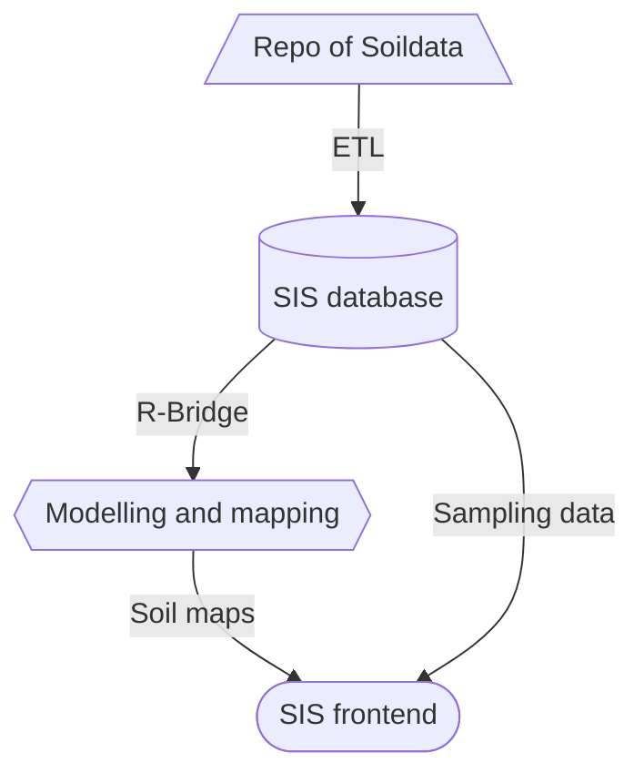

# Soil Information System (SIS) Documentation

## What is, and Why do we need a SIS?

A soil information system is a digital platform that collects, stores, and manages soil data. 
It integrates information like soil type, nutrients, pH, moisture, and land use. 
The system helps analyze soil properties for agriculture, construction, and environmental planning.
It enables mapping and visualization of soil characteristics across regions.
Organizations use it to make informed decisions about land management and resource planning.
It supports precision agriculture by guiding fertilizer use and crop selection.
It helps protect the environment by monitoring soil degradation and contamination.
Government agencies use it for zoning, infrastructure development, and conservation policies.
It improves efficiency by centralizing data for multiple departments or stakeholders.
Overall, a soil information system enhances sustainability, productivity, and long-term land stewardship.

## A template for a SIS

This repository proposes a template or startig point for setting up the technical infrastructure of a SIS.
The institutionalisation aspect of maintaining a SIS is not covered here, please check [SIS toolbox](https://resources.isric.org/sis-framework/) for this aspect. The diagram below shows an overview of the proposed SIS.

## Getting started

Besided various scripts to manage the SIS backend, this repository also contains the content of the SIS frontend website. 
So you can [clone this repository](https://docs.github.com/en/repositories/creating-and-managing-repositories/cloning-a-repository) to your github organisation, update the [configuration](../website/_quarto.yml) and your SIS will be online instantly (on the github infrastructure).

This documentation guides you in setting up the various components of the SIS on your infrastructure.

## Contents of this documentation

The SIS has various components:
- Repository of [Soil Observation data](./observation-data/) 
- [ETL](./ETL) scripts
- a [postgres](./postgres/) database server 
- Modelling of [Soil maps](./soil-maps/)
- The frontend [website](./cms/)

Optional:
- a [mapserver](./mapserver/) instance providing access to various data files 
- a [pycsw](./pycsw) catalogue tocategorise reports, maps and datasets
- a [terria-js](./terriajs/) instance for advanced map viewing options
