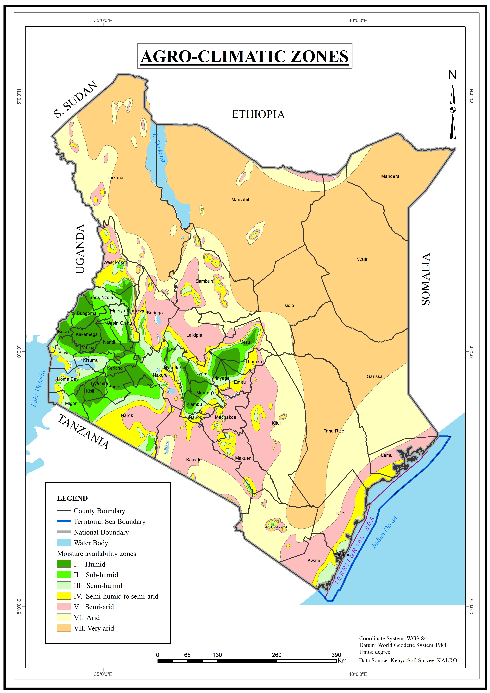

---
title: "Agro-climatic zones of Kenya"
description: A tool for assessing which areas are suitable for various land use alternatives, especially crops based on moisture availability and temperature.
author: "Kenya Soil Survey"
date: "2025-01-01"
image: Agro-climatic-zones.jpg
links:
- url: Agro-climatic-zones.jpg
categories: 
- Agro-climatic-zones
---

The Agro-Climatic Zones map shows the distribution of Kenya’s climatic resources and the similarity of areas in terms of moisture availability and temperature, considering the climatic requirements of leading crops. Zones I, II III and IV, which occupy about 17 percent of Kenya’s land area are humid to semi-humid environments with moisture indices above 50 percent and medium to very high agricultural potential. The mean annual temperatures in these areas are below 18º C and rainfall ranges between 1,000 and 2,700 mm. In addition, zones V, VI and VII, which account for over 80 percent of the land area are semi-arid to very arid areas with moisture indices below 50 percent and low to very low agricultural potential. Most arid and semi-arid regions have relatively high temperatures with rainfall varying from 150 to 900 mm. 

