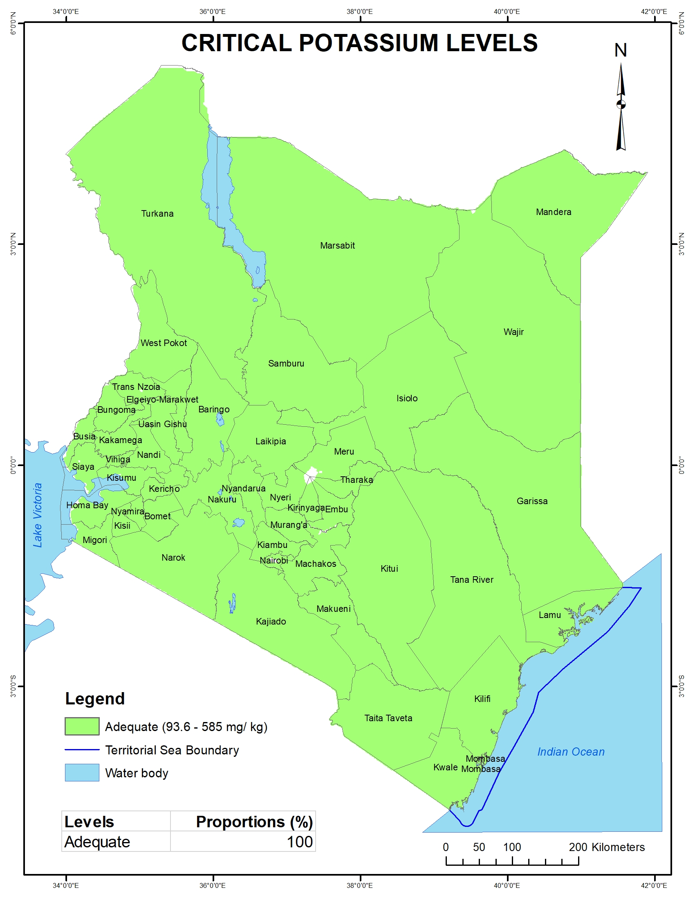

---
title: "Critical potassium levels in Kenyan soils"
description: Data provided by Kenya Soil Survey
author: "Kenya Soil Survey"
date: "2025-01-01"
image: K_level_classes.jpg
links:
- url: K_level_classes.jpg
categories: 
- soil properties
---

Potassium is one of the essential macro-nutrients that plants require to grow. K contributes towards root growth, respiration, photosynthesis, drought tolerance and disease resistance. Potassium levels are classified as low (< 93.6 Mg/ kg K), 93.6-585 mg/ kg K and excess at > 585 mg/ kg K. This map shows that, in general, Kenyan soils have no K deficiency.

