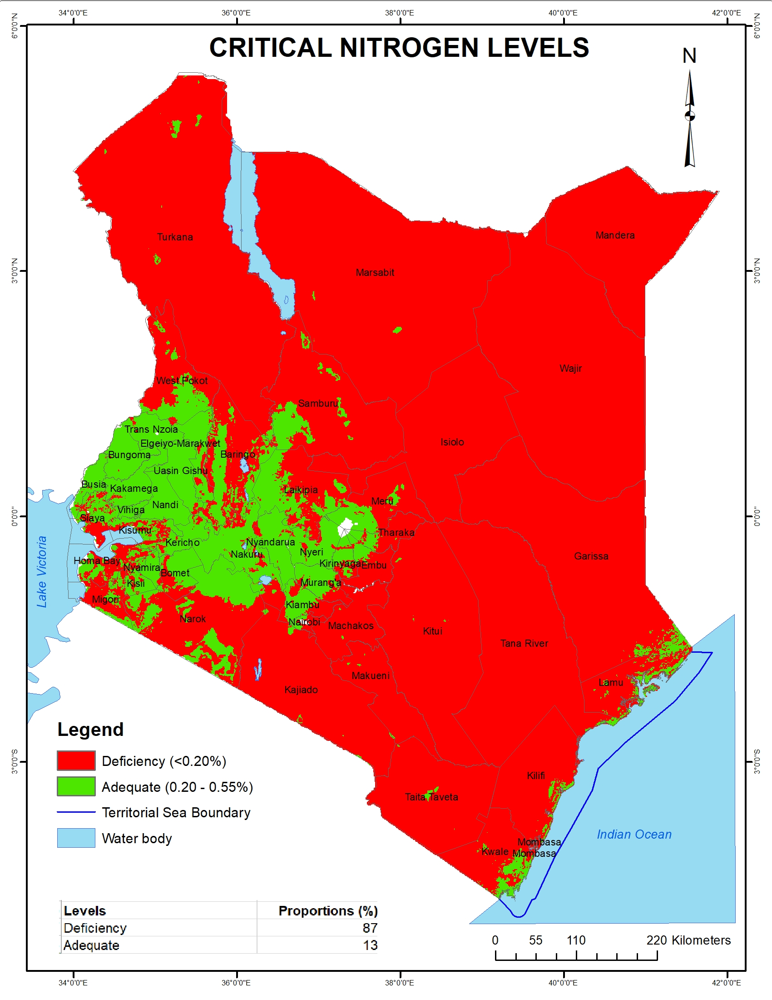

---
title: "Critical Nitrogen levels in Kenyan soils"
description: Data provided by Kenya Soil Survey
author: "Kenya Soil Survey"
date: "2025-01-01"
image: Nitrogen_level_classes.jpg
links:
- url: Nitrogen_level_classes.jpg
categories: 
- soil properties
---

Nitrogen is a major component of chlorophyll. It is normally low where soil carbon levels are low. Therefore application of nitrogenous fertilizers is recommended in areas where soil carbon are moderate to low. This analysis indicate that 87% of Kenyan soils are deficient in N.

