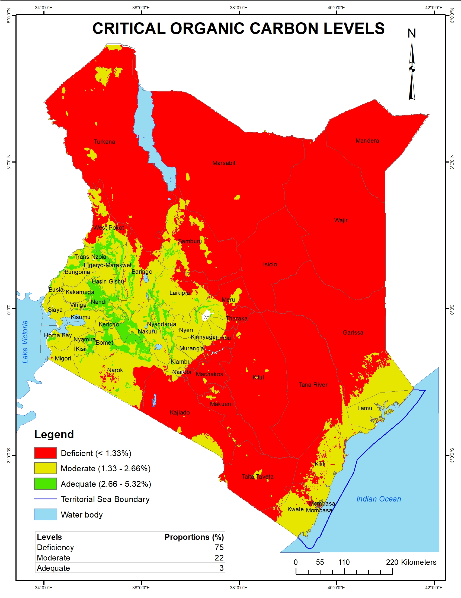

---
title: "Critical organic carbon levels in Kenyan soils"
description: Data provided by Kenya Soil Survey
author: "Kenya Soil Survey"
date: "2025-01-01"
image: OrganicC_level_classes_3.jpg
links:
- url: OrganicC_level_classes_3.jpg
categories: 
- Soil properties
---

Soil organic C influences nutrient retention and turnover, microbial activity, soil structure, moisture retention and water availability, degradation of pollutants, resists acidification, and carbon sequestration. Soil organic C is considered low at < 1.33%; moderate at 1.33 – 2.66%, adequate at 2.66 – 5.32% and excessive when > 5.32%. This map shows that 75% of Kenyan soils have low organic C content. This implies that efforts need to be made to enhance the soil C levels through practices, such as fertilizer application including manures and composts, crop rotations, and cover cropping

[Download data (4mb)](../maps/SOC_Kenya.tif)