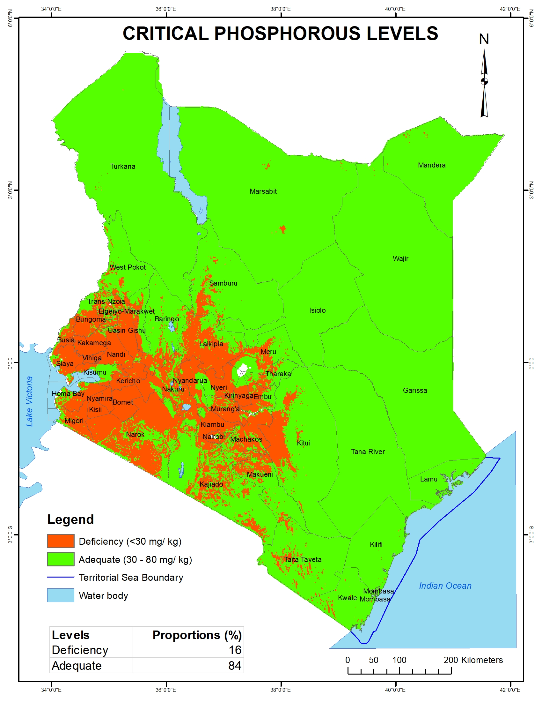

---
title: "Critical phosphorous levels in Kenyan soils"
description: Data provided by Kenya Soil Survey
author: "Kenya Soil Survey"
date: "2025-01-01"
image: P_level_classes.jpg
links:
- url: P_level_classes.jpg
categories: 
- Soil properties
---

Phosphorus is one of the most important essential elements for plant growth. Some of the plant physiological processes influenced by P include photosynthesis, root development, cell division, seed formation and water use efficiency. Phosphorus is an essential nutrient in major fertilizers used in Kenya and the world. Close to 16% of Kenyan soils are low in P. These P-deficient soils are found mainly in the high and medium rainfall areas, in the western and central highlands, pockets of Northern Kenya and coastal lowlands, and comprise about 89% of the area where maize is grown. These soils have less than 30 mg/ kg P, and require fertilization with P in order to optimize crop production and address food security needs of the country.

