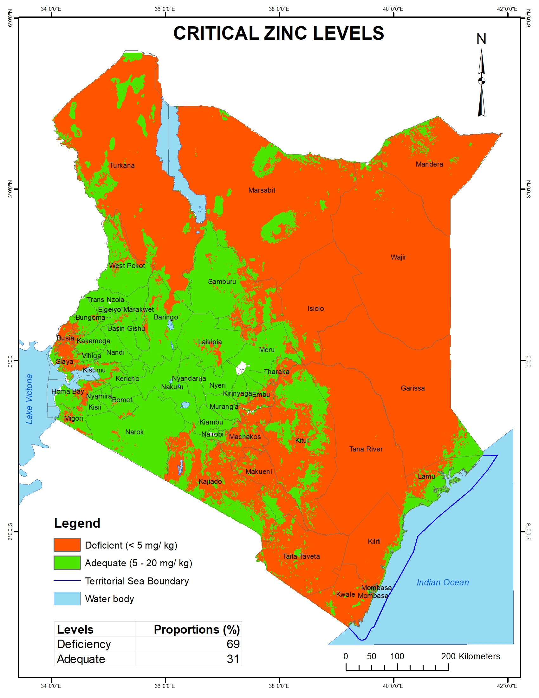

---
title: "Critical zinc levels in Kenyan soils"
description: Data provided by Kenya Soil Survey
author: "Kenya Soil Survey"
date: "2025-01-01"
image: Zinc_level_classes.jpg
links:
- url: Zinc_level_classes.jpg
categories: 
- soil properties
---

Zinc is important for plant growth and chlorophyll production. Optimal crop production range of Zn in soil is normally 5 – 20 mg/ kg. Below 5 mg/ kg Zn is considered deficient. This map shows that 69% of Kenyan soils are deficient in Zn, implying that Zn needs to be either directly applied or that fertilizers applied should be blended with Zn.

