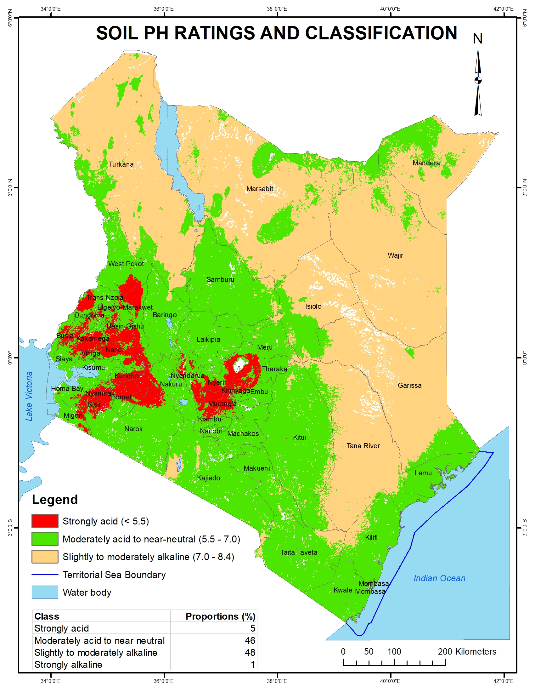

---
title: "Soil pH rating and classification in Kenya"
description: Data provided by Kenya Soil Survey
author: "Kenya Soil Survey"
date: "2025-01-01"
image: pH_classes_3.jpg
links:
- url: pH_classes_3.jpg
categories: 
- soil properties
---

Soil pH, the measure of acidity or basicity, determines many biogeochemical functions in natural and agro-ecosystems. Some of the processes influenced by soil pH include mineralization of organic matter, nitrification and denitrification, soil enzyme activities, biodegradation of organic pollutants. In this map, 5% of Kenyan soils are shown to be strongly acidic (pH <5.5). These soils comprise 30% of arable soils in Kenya’s high and medium rainfall areas. For the rest of the country, 46% of the soils are moderately acid to near neutral whilst 49% are alkaline. The soil acidity needs to be managed through liming (application of Ca and Mg containing materials to neutralize soil acidity), fertilizer application, including manures and composts, crop rotations, and cover cropping.

